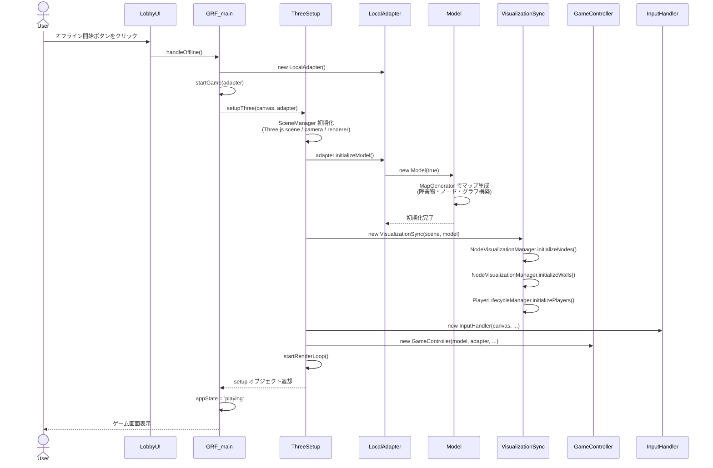
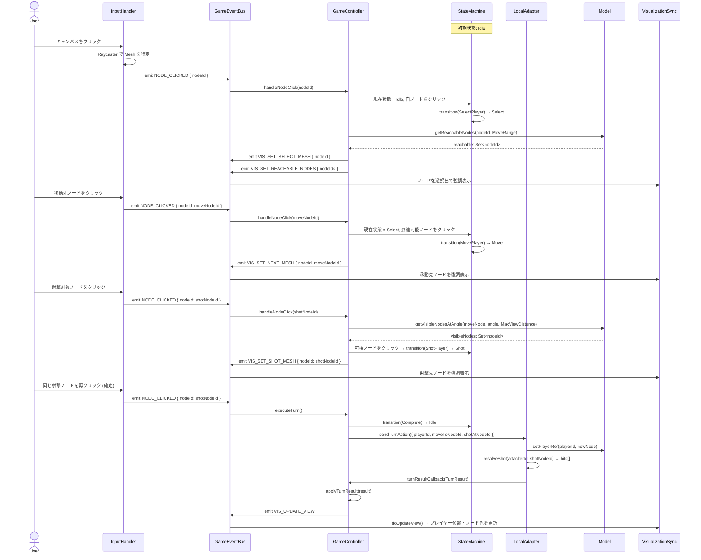
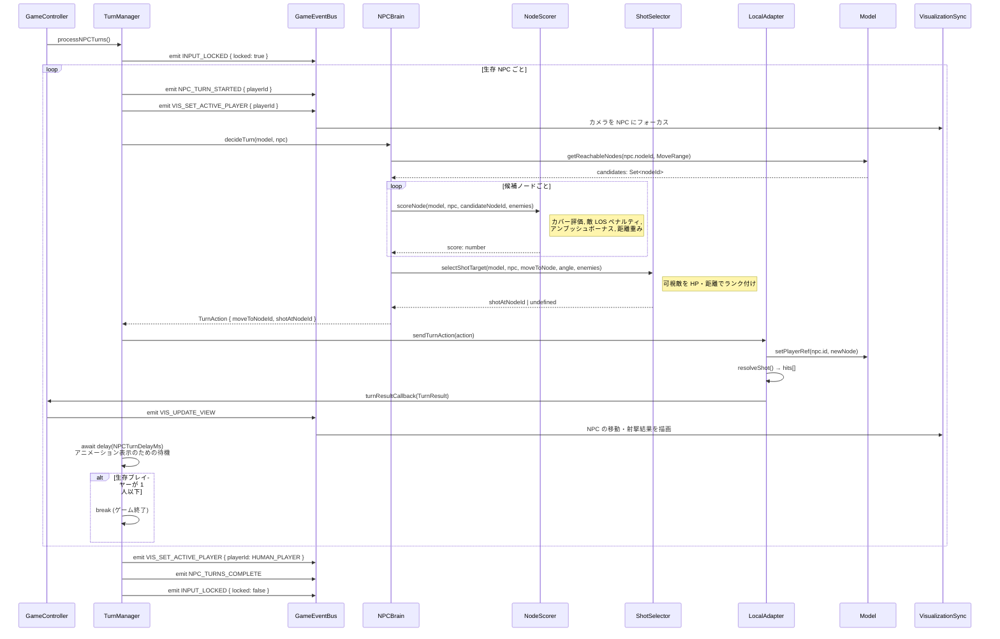
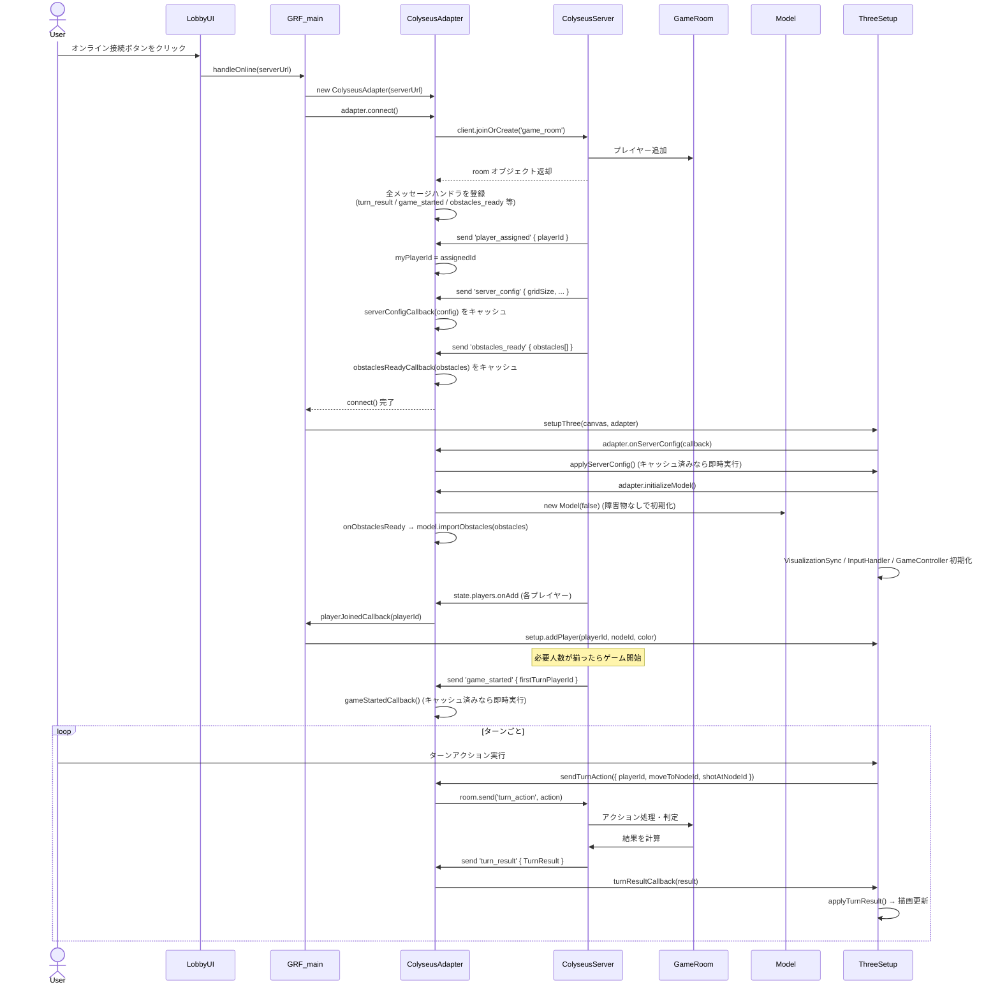
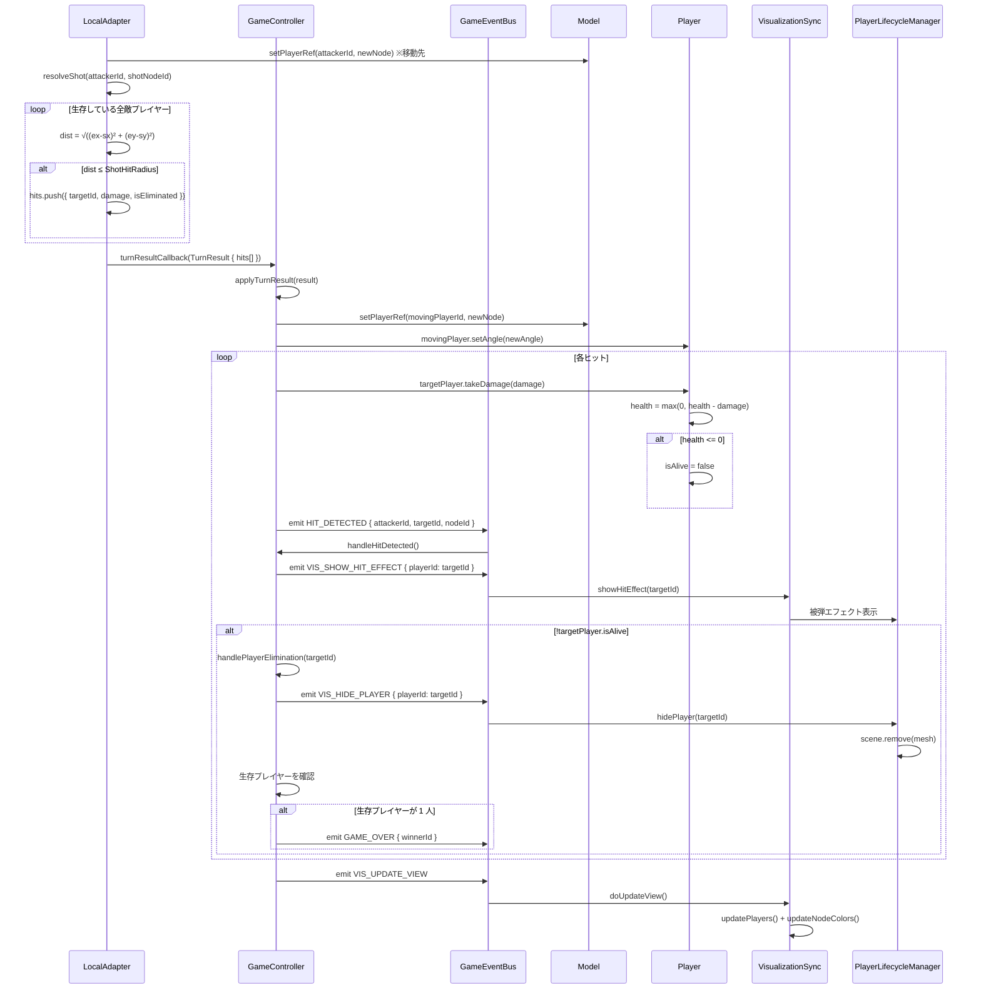
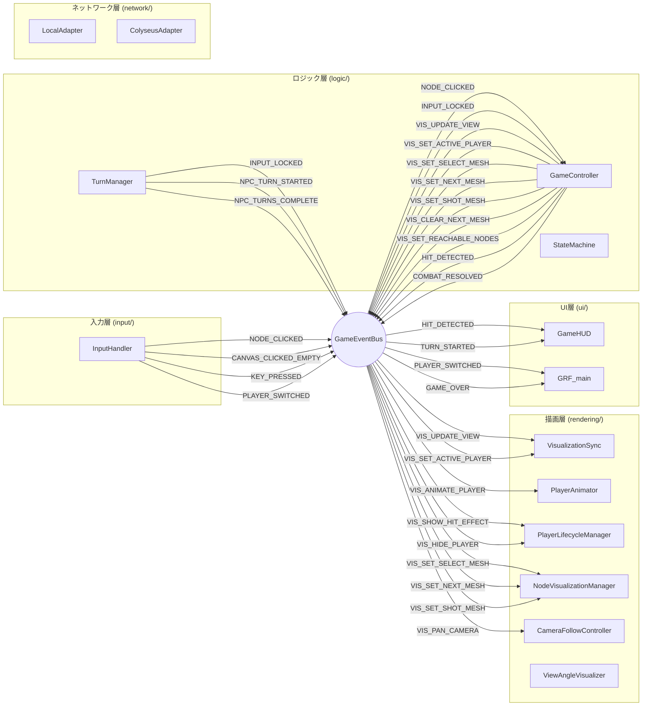
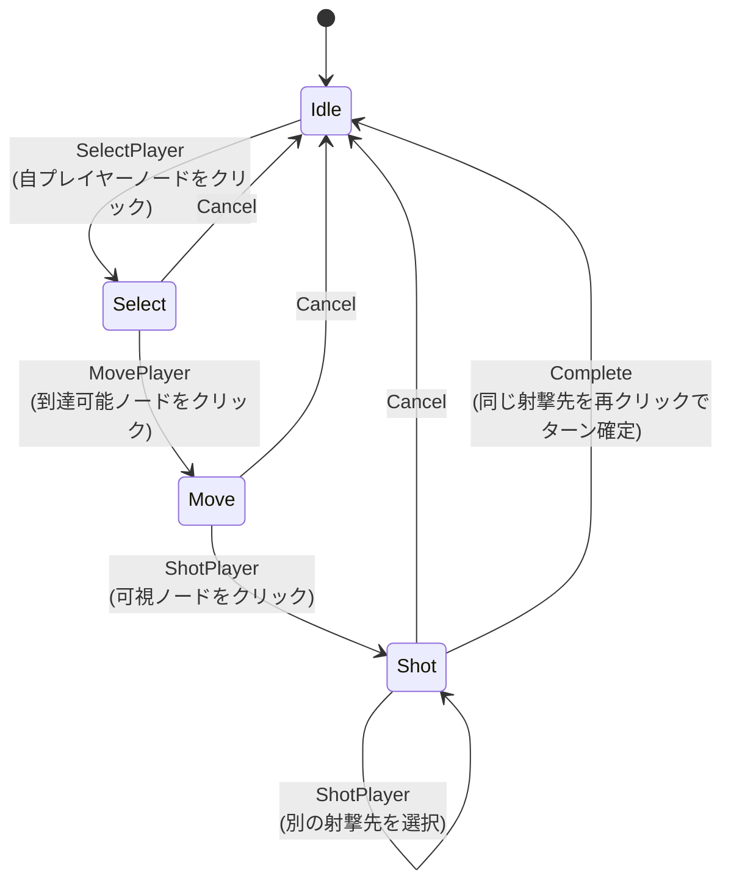

# シーケンスドキュメント

このドキュメントは 2dFps の主要なインタラクションフローを Mermaid シーケンス図で記述したものです。

---

## 目次

1. [ゲーム初期化フロー](#1-ゲーム初期化フロー)
2. [プレイヤーターンアクションフロー（オフライン）](#2-プレイヤーターンアクションフローオフライン)
3. [NPC ターンフロー](#3-npc-ターンフロー)
4. [オンライン接続・ゲーム開始フロー](#4-オンライン接続ゲーム開始フロー)
5. [戦闘解決フロー](#5-戦闘解決フロー)
6. [イベントバス全体マップ](#6-イベントバス全体マップ)

---

## 1. ゲーム初期化フロー

ロビー画面からゲーム開始までの初期化シーケンスです。

---

## 2. プレイヤーターンアクションフロー（オフライン）

マウスクリックからターン実行・描画更新までのシーケンスです。

---

## 3. NPC ターンフロー

プレイヤーのターン終了後、NPC が順番にターンを実行するシーケンスです。

---

## 4. オンライン接続・ゲーム開始フロー

Colyseus サーバーへの接続からゲーム開始までのシーケンスです。

---

## 5. 戦闘解決フロー

射撃アクション送信からヒット判定・体力更新・描画エフェクトまでのシーケンスです。

---

## 6. イベントバス全体マップ

`GameEventBus` を介した主要なイベントの発火元と購読先をまとめた図です。

---

## 補足: 状態機械の状態遷移

`StateMachine.ts` による入力処理の状態遷移図です。

