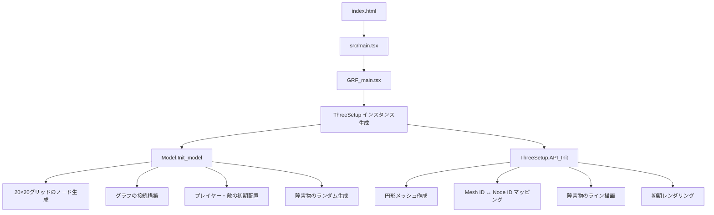
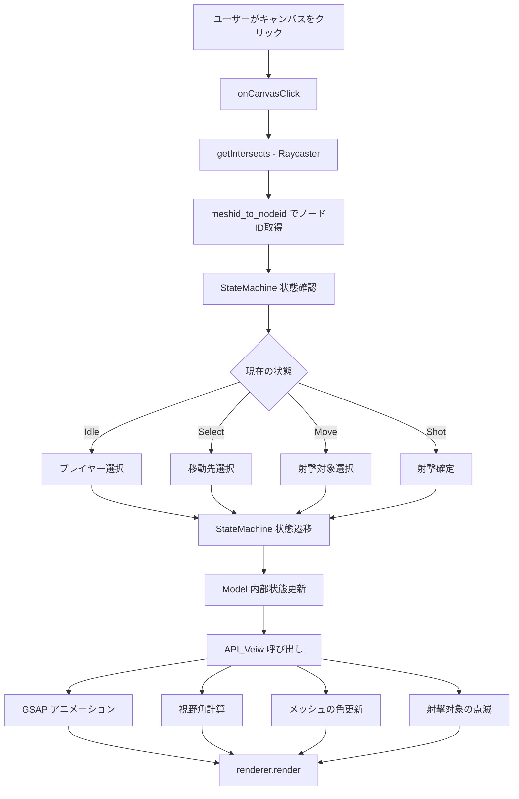
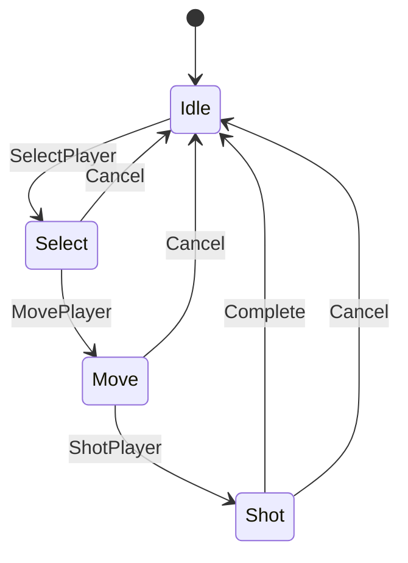
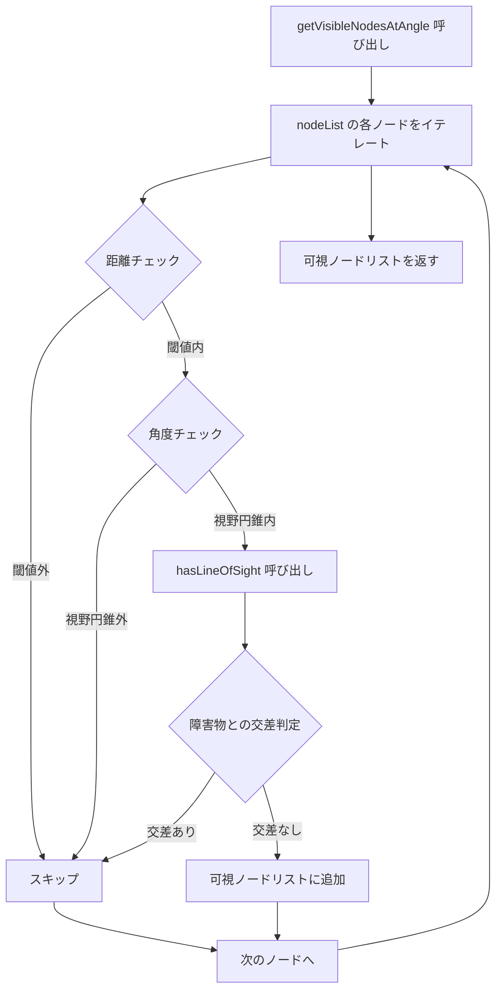
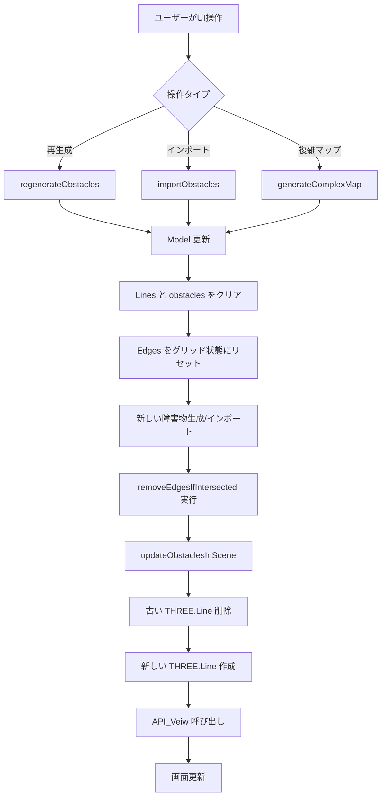

# 2D FPS データフロー設計書

## 目次
- [アーキテクチャ概要](#アーキテクチャ概要)
- [主要なデータフロー](#主要なデータフロー)
- [主要なデータ構造](#主要なデータ構造)
- [重要なアルゴリズムフロー](#重要なアルゴリズムフロー)
- [外部依存関係](#外部依存関係)
- [アーキテクチャパターン](#アーキテクチャパターン)
- [主要ファイルの役割](#主要ファイルの役割)

---

## アーキテクチャ概要

このプロジェクトは**グリッドベースの2D戦術FPSゲーム**で、Three.jsを使った3D可視化とグラフベースの経路探索を組み合わせています。

### システム構成

```
┌─────────────────────────────────────────────────┐
│           エントリポイント層                      │
│  index.html → main.tsx → ui/GRF_main.tsx       │
└──────────────────┬──────────────────────────────┘
                   ↓
┌─────────────────────────────────────────────────┐
│         UI 層 (ui/) + Rendering 層 (rendering/) │
│  - threeSetup (レンダリング・入力処理)             │
│  - ExportMenu (UI コントロール)                   │
│  - logic/StateMachine (状態管理)                 │
└──────────────────┬──────────────────────────────┘
                   ↓
┌─────────────────────────────────────────────────┐
│            Model 層 (model/)                     │
│  - Model (ゲームロジック)                         │
│  - Graph (グラフデータ構造)                       │
│  - LineSegment (幾何演算)                        │
│  - ObstacleExporter (データ永続化)                │
└──────────────────┬──────────────────────────────┘
                   ↓
┌─────────────────────────────────────────────────┐
│          Configuration 層 (config/)              │
│  - GameConfig (集約された設定)                    │
└─────────────────────────────────────────────────┘
```

---

## 主要なデータフロー

### 1. 初期化フロー



#### 詳細ステップ

1. **HTML ローディング**: `index.html` が読み込まれる
2. **React ブートストラップ**: `src/main.tsx` が React ルートを作成
3. **GRF_main マウント**: ルートコンポーネントがマウントされ、canvas ref を作成
4. **setupThree 呼び出し**: canvas を使って ThreeSetup を初期化
5. **ThreeSetup コンストラクタ**:
   - Three.js の renderer, scene, camera, controls を初期化
   - Model インスタンスを作成
6. **Model.Init_model**:
   - GameConfig に基づいて nodeList (20×20 グリッド) を生成
   - 各ノードを頂点とする Graph を作成
   - グリッドパターンでノードを接続 (addEdgeDirected)
   - プレイヤー (node 0) と敵 (node 2) の初期位置を設定
   - ランダムな障害物を生成
7. **ThreeSetup.API_Init**:
   - 各ノードに対応する円形メッシュを作成
   - 双方向マップを構築: `meshid_to_nodeid` & `nodeid_to_meshid`
   - 障害物のラインセグメントを作成
   - `API_Veiw()` を呼び出して初期レンダリング

### 2. ユーザー入力からレンダリングまでのフロー



#### 詳細ステップ

1. **マウスクリック**: ユーザーがキャンバス上でクリック
2. **onCanvasClick(mouseEvent)**: イベントハンドラが発火
3. **getIntersects()**: Raycaster を使ってクリックされたメッシュを検出
4. **ノード ID 取得**: `meshid_to_nodeid` マップから対応する nodeId を取得
5. **状態確認**: StateMachine の現在の状態をチェック
6. **状態別処理**:
   - **Idle**: プレイヤーを選択
   - **Select**: 移動先を選択
   - **Move**: 射撃対象を選択 (視野内チェック実施)
   - **Shot**: 射撃を確定または対象を変更
7. **状態遷移**: GameEvent を使って StateMachine を更新
8. **内部状態更新**:
   - `player_select`
   - `player_next`
   - `player_shot`
9. **API_Veiw() 呼び出し**: 視覚的更新をトリガー
10. **視覚的更新**:
    - GSAP によるプレイヤー/敵の移動アニメーション
    - `Model.getVisibleNodesAtAngle()` を使った可視ノード計算
    - ノード状態に基づくメッシュの色更新
    - 射撃対象への点滅アニメーション適用
11. **レンダリング**: アニメーションループ内で `renderer.render()` 実行

### 3. 状態管理フロー

```
StateMachine (列挙型ベースの有限状態機械)

State.Idle
  └─ [GameEvent.SelectPlayer] → State.Select
     └─ [GameEvent.MovePlayer] → State.Move
        └─ [GameEvent.ShotPlayer] → State.Shot
           └─ [GameEvent.Complete] → State.Idle

[GameEvent.Cancel] → どの状態からでも State.Idle へ戻る
```

#### 状態遷移図



---

## 主要なデータ構造

### Model クラスの中核データ

```typescript
class Model {
  nodeList: node[]           // 全グリッド位置 (20×20 = 400ノード)
  player: node               // 現在のプレイヤー位置
  emeny: node                // 現在の敵位置 (注: タイポあり)
  Edges: Graph               // ノード間の接続グラフ
  Lines: LineSegment[]       // 障害物の境界線
  obstacles: ObstacleData[]  // 構造化された障害物データ
}
```

### node (ノードデータ構造)

```typescript
interface node {
  id: number    // 一意の識別子 (0 から NodesInGridSize² - 1)
  x: number     // X座標 (グリッド位置 × NodeSpacing)
  y: number     // Y座標 (グリッド位置 × NodeSpacing)
}
```

### Graph (隣接リスト実装)

```typescript
class Graph {
  List: { [nodeId: number]: number[] }  // 隣接リスト
}

// 使用例:
// List[5] = [4, 6, 15]
// → ノード5はノード4, 6, 15に接続されている
```

### LineSegment (線分データ構造)

```typescript
class LineSegment {
  start: { x: number, y: number }
  end: { x: number, y: number }

  // 線分交差判定 (CCWアルゴリズム)
  intersects(p1: {x, y}, p2: {x, y}): boolean
}
```

### ObstacleData (障害物データ構造)

```typescript
interface ObstacleData {
  id: number
  segments: LineSegment[]  // 矩形を形成する4つの線分
}
```

### ThreeSetup の双方向マッピング

```typescript
class ThreeSetup {
  meshid_to_nodeid: Map<number, number>  // THREE.Mesh.id → node.id
  nodeid_to_meshid: Map<number, number>  // node.id → THREE.Mesh.id
}

// 使用例:
// ユーザーがメッシュをクリック → mesh.id を取得
// meshid_to_nodeid.get(mesh.id) → 対応する node.id を取得
```

---

## 重要なアルゴリズムフロー

### 視野計算 (getVisibleNodesAtAngle)

`src/model/model.ts` に実装されている視野角計算アルゴリズム。

```typescript
getVisibleNodesAtAngle(
  centerNode: node,    // 視点の中心ノード
  angle: number,       // 視線の方向角度 (ラジアン)
  distance: number     // 視野距離
): node[]
```

#### フロー図



#### 詳細ステップ

1. **距離計算**: 中心ノードから各ノードまでの距離を計算
2. **距離チェック**: `distance` パラメータの閾値内かチェック
3. **角度計算**: 中心ノードと対象ノード間の角度を計算
4. **視野円錐チェック**: 計算された角度が視野角 (`kakudo`) 内かチェック
5. **視線チェック**: `hasLineOfSight(centerNode, node)` を呼び出し
   - 中心ノードと対象ノード間の線分を作成
   - `Lines[]` 内のすべての障害物線分との交差判定
   - 交差がある場合は視線が遮られている
6. **フィルタリング**: すべてのチェックをパスしたノードのみを返す

### 障害物管理フロー



#### 詳細ステップ

1. **ユーザー操作**: ExportMenu からボタンクリック
2. **ThreeSetup メソッド呼び出し**:
   - `regenerateObstacles()`: 障害物をランダム再生成
   - `importObstacles(data)`: JSON から障害物をインポート
   - `generateComplexMap()`: 複雑なマップパターンを生成
3. **Model の更新**:
   - `Lines[]` と `obstacles[]` を空にする
   - `Edges` をグリッド接続状態にリセット
   - 新しい障害物データを生成またはインポート
   - `removeEdgesIfIntersected()` を実行
     - 各障害物線分と各エッジの交差をチェック
     - 交差するエッジをグラフから削除
4. **ThreeSetup.updateObstaclesInScene()**:
   - シーンから古い THREE.Line オブジェクトを削除
   - 新しい障害物線分用の THREE.Line オブジェクトを作成
   - `API_Veiw()` を呼び出して視覚更新
5. **レンダリング**: 画面が新しい障害物配置で更新される

### エッジ削除アルゴリズム (removeEdgesIfIntersected)

```typescript
// 障害物と交差するエッジを削除
removeEdgesIfIntersected(): void {
  // 各ノードペアをチェック
  for (const node1 of this.nodeList) {
    for (const node2 of this.Edges.List[node1.id] || []) {
      // 各障害物線分との交差判定
      for (const line of this.Lines) {
        if (line.intersects(node1, this.nodeList[node2])) {
          // 交差する場合、エッジを削除
          this.Edges.removeEdge(node1.id, node2)
          break
        }
      }
    }
  }
}
```

---

## 外部依存関係

### 依存関係マップ

| ライブラリ | バージョン | 使用目的 | 主な使用箇所 |
|-----------|-----------|---------|-------------|
| **React** | 19.0.0 | コンポーネント構造、ライフサイクル管理 | GRF_main.tsx, ExportMenu.tsx |
| **Three.js** | 0.174.0 | 3D シーングラフ、WebGL レンダリング、Raycaster | threeSetup.ts |
| **three-stdlib** | 2.35.14 | OrbitControls (カメラ操作) | threeSetup.ts |
| **GSAP** | 3.12.7 | スムーズなアニメーション、タイムライン制御 | threeSetup.ts (API_Veiw) |
| **XState** | 5.19.2 | 状態管理 (現在未使用) | - |
| **@xstate/react** | 5.0.2 | React 統合 (現在未使用) | - |
| **Vite** | 6.2.0 | ビルドツール、HMR、TypeScript コンパイル | ビルドプロセス |

### Three.js の使用詳細

- **Scene**: シーングラフの管理
- **WebGLRenderer**: WebGL レンダリング
- **PerspectiveCamera**: 透視投影カメラ
- **Geometries**:
  - `CircleGeometry`: ノード表示用の円形
  - `BoxGeometry`: (将来の使用に備えて)
  - `BufferGeometry`: カスタム線分描画
- **Materials**:
  - `MeshBasicMaterial`: ノードの色付き表示
  - `LineBasicMaterial`: 障害物の線表示
- **Raycaster**: マウスピッキング (2D → 3D 変換)

### GSAP の使用詳細

```typescript
// プレイヤー移動アニメーション例
gsap.to(mesh.position, {
  duration: 1,
  x: targetNode.x,
  y: targetNode.y,
  ease: "power2.inOut"
})

// 射撃対象の点滅アニメーション
gsap.to(mesh.material.color, {
  duration: 0.5,
  r: 1,
  g: 0,
  b: 0,
  yoyo: true,
  repeat: -1
})
```

---

## アーキテクチャパターン

### 1. 関心の分離 (Separation of Concerns)

```
┌─────────────┐     ┌──────────────┐     ┌─────────────┐
│   Model     │ ←── │  Controller  │ ←── │    View     │
│ (ロジック)   │     │ (ThreeSetup) │     │ (Three.js)  │
└─────────────┘     └──────────────┘     └─────────────┘
```

- **Model**: ゲームロジック、データ管理 (`src/model/model.ts`)
- **View**: Three.js によるレンダリング (`src/rendering/threeSetup.ts`)
- **Controller**: ユーザー入力処理、View と Model の橋渡し (`src/logic/GameController.ts`)

### 2. 設定駆動 (Configuration-Driven)

すべてのマジックナンバーを `src/config/GameConfig.ts` に集約:

```typescript
export const GameConfig = {
  Map: {
    NodesInGridSize: 20,
    NodeSpacing: 2,
    TotalMapSize: 40  // 計算値
  },
  Player: {
    ViewDistance: 10,
    ViewAngle: Math.PI / 3
  },
  // ...
}
```

### 3. グラフベース経路探索

- 隣接リストによる効率的なノード接続管理
- 障害物による動的なエッジ削除
- O(1) での接続チェック

### 4. Raycasting による相互作用

```
マウス座標 (2D)
  ↓
NDC (Normalized Device Coordinates)
  ↓
Raycaster
  ↓
交差する 3D メッシュ
  ↓
ノード ID
```

### 5. 双方向マッピング

```typescript
// Three.js の世界 ↔ ゲームの世界
meshid_to_nodeid: Map<number, number>
nodeid_to_meshid: Map<number, number>

// 高速な双方向ルックアップ
const nodeId = meshid_to_nodeid.get(mesh.id)
const meshId = nodeid_to_meshid.get(nodeId)
```

### 6. リアクティブ更新

```
Model 変更
  ↓
API_Veiw() 呼び出し
  ↓
視覚的更新 (色、アニメーション)
  ↓
render() 実行
```

### 7. アニメーションライブラリ統合

GSAP によりアニメーション処理をゲームロジックから分離:

```typescript
// ロジック: 位置を決定
player.next = targetNode

// アニメーション: 視覚的な遷移
gsap.to(mesh.position, { x: targetNode.x, y: targetNode.y })
```

---

## 主要ファイルの役割

### エントリポイント層

#### `src/main.tsx`
- React アプリケーションのエントリポイント
- React DOM ルートの作成とマウント
- StrictMode の設定

### UI 層 (ui/ ディレクトリ)

#### `src/ui/GRF_main.tsx`
- ルート React コンポーネント
- canvas 参照の管理
- ThreeSetup の初期化 (`setupThree`)
- ExportMenu UI オーバーレイのレンダリング
- AppState 管理 (`lobby → connecting → playing`)

#### `src/ui/ExportMenu.tsx`
- マップ管理用の UI コントロール
- 障害物のエクスポート/インポート
- マップ生成/再生成のトリガー

### Rendering 層 (rendering/ ディレクトリ)

#### `src/rendering/threeSetup.ts`
**最も重要なファイル** - コアレンダリングとインタラクション制御

主な責務:
- Three.js の初期化と全体統合 (`setupThree` 関数を export)
- SceneManager, VisualizationSync, InputHandler, GameController の組み立て
- 双方向マッピング: mesh IDs ↔ node IDs

#### `src/logic/StateMachine.ts`
- ゲーム状態マシン (Idle → Select → Move → Shot → Idle)
- 状態遷移の検証
- Enum ベースの状態とイベント定義

### Model 層 (model/ ディレクトリ)

#### `src/model/model.ts`
**コアゲームロジックとデータモデル**

主な責務:
- nodeList (グリッド上のゲーム位置) の管理
- プレイヤーと敵の位置管理
- グラフベースの接続性 (Edges)
- 視線計算
- 障害物生成と管理
- 視野円錐計算
- 複数のマップパターンジェネレータ

主要メソッド:
- `Init_model()`: ゲーム初期化
- `getVisibleNodesAtAngle()`: 視野角計算
- `hasLineOfSight()`: 視線判定
- `removeEdgesIfIntersected()`: 障害物によるエッジ削除
- `generate_random_obstruction()`: ランダム障害物生成
- `generateComplexMap()`: 複雑マップ生成

#### `src/model/Graph.ts`
- グラフデータ構造 (ノード接続性)
- 隣接リスト実装
- エッジ管理 (追加/削除)
- 有向・無向エッジのサポート

#### `src/model/node.ts`
- シンプルなノードデータ構造 (id, x, y 座標)

#### `src/model/LineSegment.ts`
- 線分の幾何演算
- 線分交差検出 (CCW アルゴリズム)
- 矩形の線分生成
- 障害物交差に基づくエッジ削除

#### `src/model/ObstacleExporter.ts`
- 障害物データのシリアライズ/デシリアライズ
- JSON エクスポート/インポート機能
- ファイルダウンロードユーティリティ

### Configuration 層

#### `src/config/GameConfig.ts`
**集約された設定定数**

設定カテゴリ:
- Map: グリッドサイズ、ノード間隔
- Player: 視野距離、視野角
- Enemy: 敵関連設定
- Node: ノード表示設定
- Obstacle: 障害物生成パラメータ
- Animation: アニメーション時間
- Camera: カメラ設定

計算値の提供:
- `TotalMapSize`: `NodesInGridSize * NodeSpacing`
- すべてのゲームパラメータの単一の真実の情報源

---

## データフロー総括

### 全体フロー図

```
┌─────────────┐
│   Config    │ (GameConfig.ts)
└──────┬──────┘
       ↓
┌─────────────┐
│    Model    │ (Model.Init_model)
└──────┬──────┘
       ↓
┌─────────────┐
│ Graph/Nodes │ (隣接リスト + 400ノード)
└──────┬──────┘
       ↓
┌─────────────┐
│ ThreeSetup  │ (API_Init)
└──────┬──────┘
       ↓
┌─────────────┐
│THREE.Scene  │ (メッシュ + ライン)
└──────┬──────┘
       ↓
┌─────────────┐
│Visual Output│ (WebGL レンダリング)
└─────────────┘
```

### インタラクションサイクル

```
┌──────────────────────────────────────────────┐
│                                              │
│  ユーザー入力 (マウスクリック)                 │
│              ↓                               │
│       Raycaster (3D ピッキング)              │
│              ↓                               │
│      Mesh ID → Node ID 変換                  │
│              ↓                               │
│       StateMachine (状態遷移)                │
│              ↓                               │
│      Model 更新 (位置、状態)                  │
│              ↓                               │
│  視覚更新 (API_Veiw)                         │
│  ├─ GSAP アニメーション                       │
│  ├─ 視野計算                                 │
│  └─ メッシュの色更新                          │
│              ↓                               │
│       Render (画面更新)                       │
│              ↓                               │
│  ──────────────────────                      │
│  (ループ継続)                                 │
│                                              │
└──────────────────────────────────────────────┘
```

### 障害物管理サイクル

```
UI アクション (再生成/インポート)
         ↓
ThreeSetup メソッド呼び出し
         ↓
Model データ更新
 ├─ Lines[] 更新
 ├─ obstacles[] 更新
 └─ Edges 更新 (交差エッジ削除)
         ↓
Scene 更新 (THREE.Line 再構築)
         ↓
API_Veiw (視覚リフレッシュ)
         ↓
Render (新しい障害物表示)
```

---

## まとめ

このアーキテクチャは以下の特徴を持つ:

1. **明確な責務分離**: Model-View-Controller パターン
2. **設定駆動の柔軟性**: すべてのパラメータが GameConfig に集約
3. **効率的なグラフ管理**: 隣接リストによる高速な接続性チェック
4. **リアクティブな視覚更新**: モデル変更が自動的に視覚に反映
5. **スムーズなアニメーション**: GSAP による宣言的アニメーション定義
6. **型安全性**: TypeScript によるコンパイル時の型チェック

データは **一方向フロー** (Config → Model → View) で初期化され、ユーザーインタラクションは **イベント駆動サイクル** (Input → StateMachine → Model → View) で処理されます。
