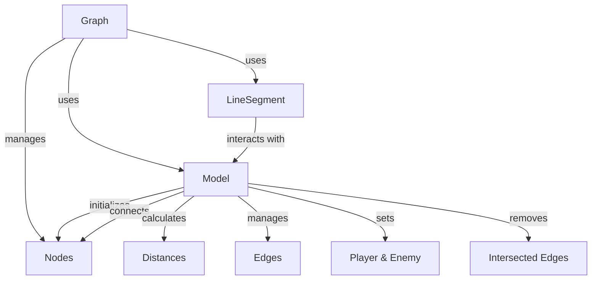

```mermaid
graph TD;
    A[Graph] -->|uses| B[LineSegment]
    A -->|uses| C[Model]
    B -->|interacts with| C
    A -->|manages| D[Nodes]
    C -->|initializes| D
    C -->|connects| D
    C -->|calculates| E[Distances]
    C -->|manages| F[Edges]
    C -->|sets| G[Player & Enemy]
    C -->|removes| H[Intersected Edges]
```