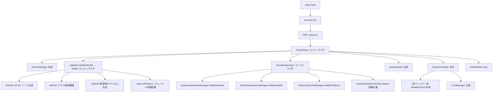
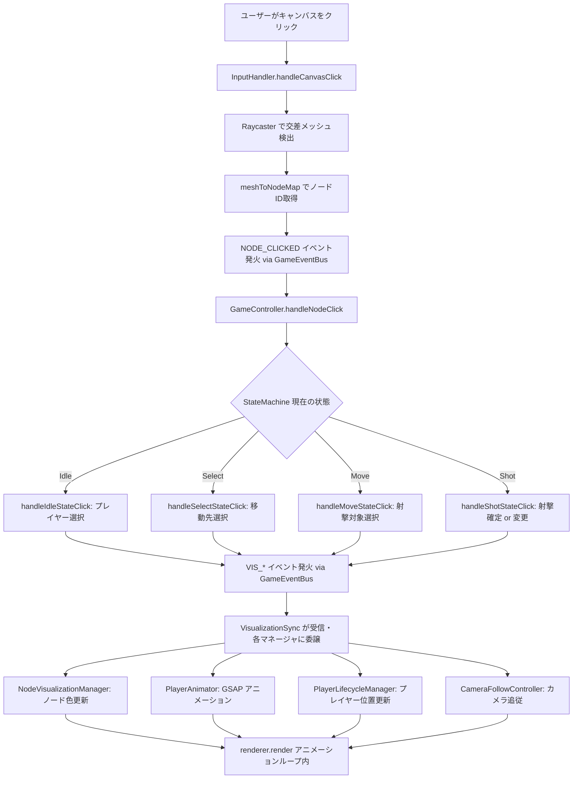
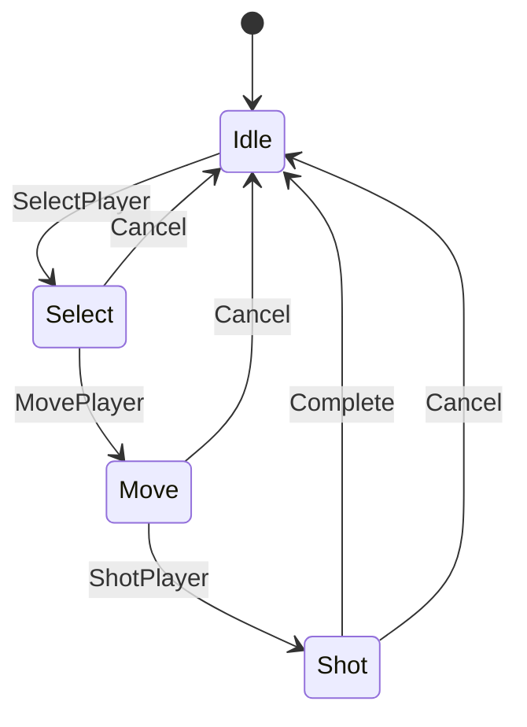
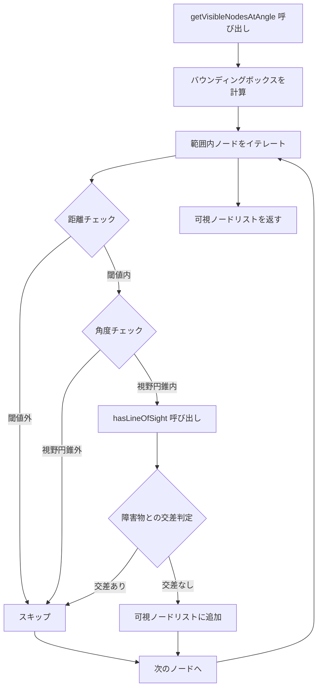
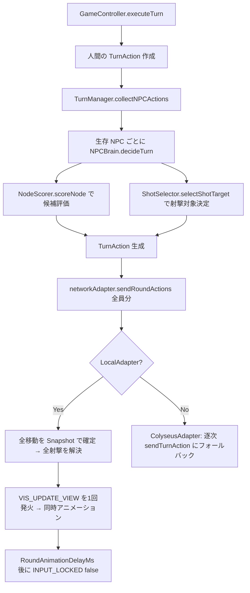
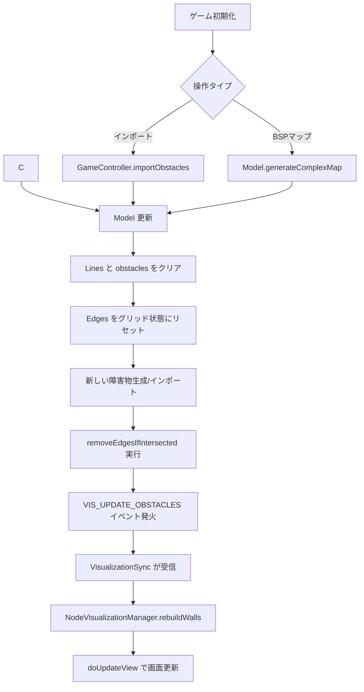

# 2D FPS データフロー設計書

## 目次
- [アーキテクチャ概要](#アーキテクチャ概要)
- [主要なデータフロー](#主要なデータフロー)
- [主要なデータ構造](#主要なデータ構造)
- [重要なアルゴリズムフロー](#重要なアルゴリズムフロー)
- [外部依存関係](#外部依存関係)
- [アーキテクチャパターン](#アーキテクチャパターン)
- [主要ファイルの役割](#主要ファイルの役割)

---

## アーキテクチャ概要

このプロジェクトは**グリッドベースの2D戦術FPSゲーム**で、Three.jsを使った3D可視化とグラフベースの経路探索を組み合わせています。
全レイヤー間の通信は **GameEventBus** を介した疎結合設計です。

### システム構成

```
┌───────────────────────────────────────────────────────┐
│           エントリポイント層                              │
│  index.html → main.tsx → ui/GRF_main.tsx              │
└──────────────────┬────────────────────────────────────┘
                   ↓
┌───────────────────────────────────────────────────────┐
│  UI 層 (ui/)                                           │
│  GRF_main.tsx, LobbyUI, GameHUD, ConsoleLogger        │
└──────────────────┬────────────────────────────────────┘
                   ↓
┌───────────────────────────────────────────────────────┐
│  Core (core/)                                          │
│  GameEventBus — 全レイヤー間の疎結合イベント通信          │
└──────┬────────────────────────────────────────────────┘
       ↓
┌──────────────┬──────────────────┬─────────────────────┐
│ Input        │ Logic                  │ Network              │
│ (input/)     │ (logic/)               │ (network/)           │
│ InputHandler │ GameController         │ LocalAdapter         │
│              │ StateMachine           │ ColyseusAdapter      │
│              │ TurnManager            │                      │
│              │ ai/(NPCBrain, etc.)    │                      │
└──────┬───────┴────────┬─────────┴─────────────────────┘
       ↓                ↓
┌───────────────────────────────────────────────────────┐
│  Rendering 層 (rendering/)                             │
│  threeSetup → VisualizationSync (オーケストレーター)     │
│  ├─ PlayerAnimator         ├─ NodeVisualizationManager │
│  ├─ PlayerLifecycleManager └─ CameraFollowController   │
└──────────────────┬────────────────────────────────────┘
                   ↓
┌───────────────────────────────────────────────────────┐
│  Model 層 (model/)                                     │
│  Model, Graph, Player, Node, MapGenerator, LineSegment │
└──────────────────┬────────────────────────────────────┘
                   ↓
┌───────────────────────────────────────────────────────┐
│  Configuration 層 (config/)                            │
│  GameConfig                                           │
└───────────────────────────────────────────────────────┘
```

---

## 主要なデータフロー

### 1. 初期化フロー



#### 詳細ステップ

1. **HTML ローディング**: `index.html` が読み込まれる
2. **React ブートストラップ**: `src/main.tsx` が React ルートを作成
3. **GRF_main マウント**: ルートコンポーネントがマウントされ、canvas ref を作成
4. **ThreeSetup コンストラクタ**:
   - `SceneManager` を生成（Three.js の renderer, scene, camera, controls を初期化）
   - `adapter.initializeModel()` で `Model` インスタンスを取得
5. **Model コンストラクタ** (`initGrid` + `initLocalPlayers`):
   - GameConfig に基づいて `nodeList` (20×20 グリッド) を生成
   - 各ノードを頂点とする `Graph` を作成し方向別エッジを接続
   - ランダムな障害物を生成（`MapGenerator` 経由）
   - ローカルプレイヤーを `players: Map<string, Player>` に配置
6. **VisualizationSync コンストラクタ**:
   - `NodeVisualizationManager` でノードメッシュと壁メッシュを生成
   - `PlayerLifecycleManager` でプレイヤーメッシュを生成
   - `CameraFollowController` で初期プレイヤー位置にカメラをスナップ
   - `GameEventBus` の `VIS_*` イベントを購読
7. **InputHandler 生成**: canvas のクリック・キーボードイベントをリスン
8. **GameController 生成**: 各プレイヤー用の `StateMachine` と `TurnManager` を作成、イベント購読を設定
9. **startRenderLoop**: アニメーションループを開始

### 2. ユーザー入力からレンダリングまでのフロー



#### 詳細ステップ

1. **マウスクリック**: ユーザーがキャンバス上でクリック
2. **InputHandler.handleCanvasClick**: イベントハンドラが発火
3. **Raycaster**: Three.js Raycaster を使ってクリックされたメッシュを検出
4. **ノード ID 取得**: `meshToNodeMap` (NodeVisualizationManager 管理) から対応する nodeId を取得
5. **NODE_CLICKED イベント発火**: `GameEventBus` 経由で `GameController` に通知
6. **GameController.handleNodeClick**: StateMachine の現在の状態を確認し、状態別ハンドラを実行
7. **状態別処理**:
   - **Idle**: 自分のノードをクリック → `VIS_SET_SELECT_MESH` 発火
   - **Select**: 隣接ノードをクリック → `VIS_SET_NEXT_MESH` 発火
   - **Move**: 視野内ノードをクリック → `VIS_SET_SHOT_MESH` 発火
   - **Shot**: 同じノード再クリック → `executeTurn` でターン実行 / 別ノード → 射撃対象変更
8. **VIS_UPDATE_VIEW イベント発火**: 描画更新をトリガー
9. **VisualizationSync が各マネージャに委譲**:
   - `NodeVisualizationManager`: ノードメッシュの色更新
   - `PlayerAnimator`: GSAP によるプレイヤー移動アニメーション
   - `CameraFollowController`: カメラ追従パン
10. **レンダリング**: アニメーションループ内で `renderer.render()` 実行

### 3. 状態管理フロー

```
StateMachine (State パターンによる有限状態機械)

State.Idle
  └─ [GameEvent.SelectPlayer] → State.Select
     └─ [GameEvent.MovePlayer] → State.Move
        └─ [GameEvent.ShotPlayer] → State.Shot
           └─ [GameEvent.Complete] → State.Idle

[GameEvent.Cancel] → どの状態からでも State.Idle へ戻る
```

#### 状態遷移図



**実装**: `IState` インターフェースと具象状態クラス (`IdleState`, `SelectState`, `MoveState`, `ShotState`) による State パターン。各状態クラスが有効な遷移を内部に持つ。

---

## 主要なデータ構造

### Model クラスの中核データ

```typescript
class Model {
  nodeList: Node[]                    // 全グリッド位置 (20×20 = 400ノード)
  players: Map<string, Player>        // プレイヤーID → Player エンティティ
  Edges: Graph                        // ノード間の接続グラフ
  Lines: LineSegment[]                // 障害物の境界線
  private obstacles: ObstacleData[]   // 障害物データ（getObstacles() でアクセス）
  private lastSeed: string            // 最後に使用したマップ生成シード
}
```

### Node (ノードデータ構造)

```typescript
class Node {
  id: number    // 一意の識別子 (0 から NodesInGridSize² - 1)
  x: number     // X座標 (グリッド位置 × NodeSpacing)
  y: number     // Y座標 (グリッド位置 × NodeSpacing)
}
```

### Player (プレイヤーエンティティ)

```typescript
class Player extends Entity {
  health: number       // 現在HP
  maxHealth: number    // 最大HP
  isAlive: boolean     // 生存状態
  // Entity から継承: id, node, color, angle
}
```

### Graph (隣接リスト実装)

```typescript
class Graph {
  List: { [nodeId: number]: number[] }  // 隣接リスト
}

// 使用例:
// List[5] = [4, 6, 15]
// → ノード5はノード4, 6, 15に接続されている
```

### LineSegment (線分データ構造)

```typescript
class LineSegment {
  start: { x: number, y: number }
  end: { x: number, y: number }

  // 線分交差判定 (CCWアルゴリズム)
  intersects(p1: {x, y}, p2: {x, y}): boolean
}
```

### ObstacleData (障害物データ構造)

```typescript
interface ObstacleData {
  id: number
  segments: LineSegment[]  // 矩形を形成する4つの線分
}
```

### 双方向マッピング (NodeVisualizationManager 管理)

```typescript
meshToNodeMap: Map<number, number>  // THREE.Mesh.id → node.id
nodeToMeshMap: Map<number, number>  // node.id → THREE.Mesh.id

// 使用例:
// ユーザーがメッシュをクリック → mesh.id を取得
// meshToNodeMap.get(mesh.id) → 対応する node.id を取得
```

---

## 重要なアルゴリズムフロー

### 視野計算 (getVisibleNodesAtAngle)

`src/model/model.ts` に実装されている視野角計算アルゴリズム。

```typescript
getVisibleNodesAtAngle(
  centerNode: Node,    // 視点の中心ノード
  angle: number,       // 視線の方向角度 (度)
  distance: number     // 視野距離
): Node[]
```

#### フロー図



#### 詳細ステップ

1. **バウンディングボックス計算**: グリッド座標から視野距離内のノード範囲を算出（全ノード走査を回避）
2. **距離計算**: 中心ノードから各ノードまでの距離を計算
3. **距離チェック**: `distance` パラメータの閾値内かチェック
4. **角度計算**: ドット積を使って方向ベクトルとの角度を計算
5. **視野円錐チェック**: 計算された角度が `viewAngle` 内かチェック
6. **視線チェック**: `hasLineOfSight(centerNode, node)` を呼び出し
   - 中心ノードと対象ノード間の線分を作成
   - `Lines[]` 内のすべての障害物線分との交差判定
   - 交差がある場合は視線が遮られている
7. **フィルタリング**: すべてのチェックをパスしたノードのみを返す

### BFS 経路探索 (model.ts)

`feature/npc-tactical-ai` で追加された BFS ベースの複数マス移動機能。

```typescript
// 到達可能ノードを BFS で取得
getReachableNodes(fromNodeId: number, maxSteps: number): Set<number>

// BFS 最短経路
getPathToNode(fromNodeId: number, toNodeId: number, maxSteps: number): number[] | null
```

**フロー**:
1. キューに開始ノードを積む
2. グラフ隣接リストを BFS 探索（障害物で削除済みエッジはスキップ）
3. `maxSteps` ステップ以内の全ノードを `Set<number>` で返す
4. `VIS_SET_REACHABLE_NODES` イベントで可視化層に通知 → ノード色でハイライト表示

### 同時移動ラウンド制 (GameController + TurnManager + LocalAdapter)

人間プレイヤーが行動を確定すると、全 NPC の行動をまとめて収集し、全員の移動・射撃をアトミックに解決する。



**NodeScorer のスコア計算要素**:

| 要素 | 設定値 | 説明 |
|------|--------|------|
| カバー評価 | `CoverWeight=30` | 隣接エッジが少ない（壁に囲まれている）ほど加点 |
| 敵 LOS ペナルティ | `EnemyLOSPenalty=-20` | 敵に見えるノードにペナルティ |
| アンブッシュボーナス | `AmbushBonus=15` | NPC が見えて敵が見えない状況に加点 |
| 距離評価 | `DistanceWeight=-2` | 高HP→接近、低HP（`RetreatHPThreshold=40`）→退却 |
| 撤退カバー | `RetreatCoverMultiplier=2` | 撤退モード時のカバーウェイト乗数 |
| 低HP射撃優先 | `ShotLowHPPriority=10` | 低 HP 敵への射撃優先度ボーナス |

### 障害物管理フロー



#### 詳細ステップ

1. **トリガー**: ゲーム初期化時に `Model.generateComplexMap()` でマップ生成、または `importObstacles(data)` でインポート
2. **GameController メソッド呼び出し**:
   - `importObstacles(data)`: JSON から障害物をインポート
3. **Model の更新** (`MapGenerator` 経由):
   - `Lines[]` と `obstacles[]` を空にする
   - `Edges` をグリッド接続状態にリセット
   - 新しい障害物データを生成またはインポート
   - `removeEdgesIfIntersected()` を実行（障害物と交差するエッジを削除）
4. **VIS_UPDATE_OBSTACLES イベント発火**: `GameEventBus` 経由で描画層に通知
5. **VisualizationSync → NodeVisualizationManager.rebuildWalls()**: 壁メッシュを再構築
6. **doUpdateView()**: ノードの色状態・視野角を再計算して描画更新

### BSP マップ生成アルゴリズム (MapGenerator.generateComplexMap)

`src/model/MapGenerator.ts` に実装。シード付き決定的PRNG (mulberry32 + FNV-1a) で再現可能なマップを生成。

#### 生成フェーズ

1. **BSP ツリー構築**: 空間を再帰的に二分割
2. **部屋配置**: リーフセルに部屋を配置
3. **部屋の壁とドア**: 壁にドア開口部を設置
4. **廊下接続**: 隣接部屋間を廊下で接続
5. **戦術要素**: 柱やハーフウォールを配置
6. **左右ミラー**: 左半分を右半分にミラーリング
7. **中央チョークポイント**: マップ中央に戦術的要素を追加

### エッジ削除アルゴリズム (removeEdgesIfIntersected)

```typescript
// 障害物と交差するエッジを削除
removeEdgesIfIntersected(): void {
  // 各ノードペアをチェック
  for (const node1 of this.nodeList) {
    for (const node2 of this.Edges.List[node1.id] || []) {
      // 各障害物線分との交差判定
      for (const line of this.Lines) {
        if (line.intersects(node1, this.nodeList[node2])) {
          // 交差する場合、エッジを削除
          this.Edges.removeEdge(node1.id, node2)
          break
        }
      }
    }
  }
}
```

---

## 外部依存関係

### 依存関係マップ

| ライブラリ | バージョン | 使用目的 | 主な使用箇所 |
|-----------|-----------|---------|-------------|
| **React** | 19 | コンポーネント構造、ライフサイクル管理 | ui/ (GRF_main, LobbyUI, GameHUD, ConsoleLogger) |
| **Three.js** | 0.174 | 3D シーングラフ、WebGL レンダリング、Raycaster | rendering/ 全ファイル |
| **three-stdlib** | 2.35 | OrbitControls (カメラ操作) | SceneManager.ts |
| **GSAP** | 3.12 | スムーズなアニメーション、タイムライン制御 | PlayerAnimator.ts, PlayerLifecycleManager.ts, CameraFollowController.ts |
| **colyseus.js** | 0.15.28 | Colyseus クライアント SDK | ColyseusAdapter.ts |
| **Vite** | 6.2 | ビルドツール、HMR、TypeScript コンパイル | ビルドプロセス |

### Three.js の使用詳細

- **Scene**: シーングラフの管理 (`SceneManager.ts`)
- **WebGLRenderer**: WebGL レンダリング (`SceneManager.ts`)
- **PerspectiveCamera**: 透視投影カメラ (`SceneManager.ts`)
- **Raycaster**: マウスピッキング (`InputHandler.ts`)
- **Geometries / Materials**: ノード・壁・プレイヤーのメッシュ生成 (`NodeWallMeshFactory.ts`, `PlayerMeshFactory.ts`)

### GSAP の使用詳細

```typescript
// プレイヤー移動アニメーション (PlayerAnimator.ts)
gsap.to(mesh.position, {
  duration: 1,
  x: targetNode.x,
  y: targetNode.y,
  ease: "power2.inOut"
})

// カメラ追従 (CameraFollowController.ts)
gsap.to(camera.position, {
  duration: 0.5,
  x: targetX,
  y: targetY,
  ease: "power2.out"
})
```

---

## アーキテクチャパターン

### 1. イベント駆動アーキテクチャ (GameEventBus)

```
┌─────────────┐     GameEventBus      ┌──────────────────┐
│ InputHandler │ ── NODE_CLICKED ──→  │  GameController   │
└─────────────┘                       └────────┬─────────┘
                                               │
                                        VIS_* イベント
                                               │
                                    ┌──────────↓──────────┐
                                    │  VisualizationSync   │
                                    │  (オーケストレーター)  │
                                    └──────────────────────┘
```

- **Input → Logic**: `NODE_CLICKED`, `CANVAS_CLICKED_EMPTY`, `KEY_PRESSED`
- **Logic → Rendering**: `VIS_UPDATE_VIEW`, `VIS_SET_SELECT_MESH`, `VIS_SET_NEXT_MESH`, `VIS_SET_SHOT_MESH` 等
- **Logic → Input**: `INPUT_LOCKED`（ラウンド処理中に入力をロック）
- **NPC**: `NPC_TURN_STARTED`, `NPC_TURNS_COMPLETE`（TurnManager → GameController）
- **Player**: `PLAYER_MOVED`, `PLAYER_SELECTED`, `PLAYER_SWITCHED`, `PLAYER_ANGLE_CHANGED`
- **Network**: `NETWORK_CONNECTED`, `ROOM_STATE_CHANGED`, `TURN_RESULT_RECEIVED`, `PLAYER_JOINED`
- **Controller が Model を直接操作し、描画にはイベントのみを発行**（Model-View 分離）

### 2. オーケストレーター委譲パターン (VisualizationSync)

```
VisualizationSync (薄いオーケストレーター)
├── PlayerAnimator           # GSAP によるプレイヤーアニメーション
├── PlayerLifecycleManager   # プレイヤーメッシュの生成・破棄・状態遷移
├── NodeVisualizationManager # ノードメッシュ管理・色状態・双方向マッピング
└── CameraFollowController   # カメラ追従・パンアニメーション
```

`VisualizationSync` は `GameEventBus` の `VIS_*` イベントを購読し、適切なマネージャに委譲する。自身はロジックを持たない。

### 3. 設定駆動 (Configuration-Driven)

すべてのマジックナンバーを `src/config/GameConfig.ts` に集約:

```typescript
export const MapConfig = {
  NodesInGridSize: 20,
  NodeSpacing: 2,
};

export const PlayerConfig = {
  ViewAngle: 60,
  MaxViewDistance: 1000,
};

export const BSPMapConfig = {
  MaxDepth: 4,
  MinCellSize: 5,
  // ... 19パラメータ
};
```

### 4. State パターン (StateMachine)

```typescript
interface IState {
  name: State;
  transition(event: GameEvent): IState;
}

// 具象状態クラス: IdleState, SelectState, MoveState, ShotState
// 各クラスが有効な遷移ルールを内部に持つ
```

### 5. ネットワークアダプターパターン

```
INetworkAdapter
├── LocalAdapter    オフライン: プロセス内でゲームロジックを実行
└── ColyseusAdapter オンライン: WebSocket で Colyseus サーバーに接続
```

`GameController` と `ThreeSetup` は `INetworkAdapter` にのみ依存し、どちらの実装か意識しない。

### 6. グラフベース経路探索

- 隣接リストによる効率的なノード接続管理
- 障害物による動的なエッジ削除
- O(1) での接続チェック

### 7. Raycasting による相互作用

```
マウス座標 (2D)
  ↓
NDC (Normalized Device Coordinates)
  ↓
Raycaster
  ↓
交差する 3D メッシュ
  ↓
meshToNodeMap → ノード ID
  ↓
NODE_CLICKED イベント (GameEventBus)
```

### 8. 双方向マッピング (NodeVisualizationManager)

```typescript
meshToNodeMap: Map<number, number>  // THREE.Mesh.id → node.id
nodeToMeshMap: Map<number, number>  // node.id → THREE.Mesh.id

// 高速な双方向ルックアップ
const nodeId = meshToNodeMap.get(mesh.id)
const meshId = nodeToMeshMap.get(nodeId)
```

---

## 主要ファイルの役割

### エントリポイント層

#### `src/main.tsx`
- React アプリケーションのエントリポイント
- React DOM ルートの作成とマウント

### UI 層 (ui/)

#### `src/ui/GRF_main.tsx`
- ルート React コンポーネント
- canvas 参照の管理
- ThreeSetup の初期化
- AppState 管理 (`lobby → connecting → playing`)

#### `src/ui/LobbyUI.tsx`
- ゲーム開始前のロビー画面
- オフライン/オンラインモード選択

#### `src/ui/GameHUD.tsx`
- ゲーム中のHUD表示
- 体力表示、ターン情報、プレイヤー切替

#### `src/ui/ConsoleLogger.tsx`
- ゲームログのコンソール表示

### Core 層 (core/)

#### `src/core/GameEventBus.ts`
- アプリケーション全体のイベントハブ
- 型安全な pub/sub (`GameEventType` 列挙型 + `GameEventData` インターフェース)
- 入力→ロジック→描画のレイヤー間通信を疎結合に接続
- デバッグモード対応（イベント履歴トラッキング）

### Logic 層 (logic/)

#### `src/logic/StateMachine.ts`
- State パターンによる有限状態機械
- `IState` インターフェースと具象状態クラス (`IdleState`, `SelectState`, `MoveState`, `ShotState`)
- 各プレイヤーが独立した `StateMachine` インスタンスを持つ

#### `src/logic/TurnManager.ts`
- `collectNPCActions()` で全 NPC の `TurnAction` を一括収集して返す
- `NPCBrain.decideTurn()` で各 NPC の行動を決定

#### `src/logic/ai/NPCBrain.ts`
- `decideTurn(model, npc): TurnAction` — NPC 行動決定のエントリポイント（Facade パターン）
- NodeScorer・ShotSelector を組み合わせて移動先と射撃対象を決定

#### `src/logic/ai/NodeScorer.ts`
- `scoreNode(model, npc, candidateNodeId, enemies): number`
- カバー・LOS 露出・アンブッシュ・距離でノードをスコアリング

#### `src/logic/ai/ShotSelector.ts`
- `selectShotTarget(model, npc, moveToNode, angle, enemies): number | undefined`
- 視野内の生存敵を HP・距離でランク付けして射撃対象を選択

#### `src/logic/GameController.ts`
- ゲーム全体の制御（ターン入力受付、Model 更新、`VIS_*` イベント発火）
- `GameEventBus` の `NODE_CLICKED`, `CANVAS_CLICKED_EMPTY` 等を購読
- `currentNextNodeId` / `currentShotNodeId` で選択状態を管理
- `INetworkAdapter` 経由でターンアクションを送信
- `applyTurnResult` でサーバー/ローカルからのターン結果を適用

### Rendering 層 (rendering/)

#### `src/rendering/threeSetup.ts`
- 組み立て・初期化エントリ (`setupThree` 関数を export)
- SceneManager, VisualizationSync, InputHandler, GameController の生成と接続
- レンダリングループの管理

#### `src/rendering/SceneManager.ts`
- Three.js の `Scene`, `Camera`, `Renderer`, `Controls` を管理

#### `src/rendering/PlayerMeshFactory.ts`
- プレイヤーキャラクターの3Dメッシュ生成（パーツ構成定義含む）

#### `src/rendering/PlayerAnimator.ts`
- GSAP によるプレイヤーアニメーション（移動、ダンス、被弾演出、リコイル）

#### `src/rendering/PlayerLifecycleManager.ts`
- プレイヤーメッシュの生成・破棄・状態遷移管理
- `PlayerMeshFactory` を利用してメッシュ生成

#### `src/rendering/CameraFollowController.ts`
- カメラ追従制御
- GSAP によるスムーズなパンアニメーション

#### `src/rendering/VisualizationSync.ts`
- 薄いオーケストレーター（ロジックを持たない）
- `GameEventBus` の `VIS_*` イベントを受信し4つの専門マネージャに委譲
- 外部API: `updateView()`, `updateObstacles()`, `addPlayerMesh()`, `getMeshList()`, `getMeshToNodeMap()`

#### `src/rendering/ViewAngleVisualizer.ts`
- 視野角のエッジライン描画

#### `src/rendering/NodeVisualizationManager.ts`
- ノードメッシュの色状態管理（選択、移動先、射撃先）
- 双方向マッピング管理 (`meshToNodeMap` / `nodeToMeshMap`)
- 壁メッシュの初期化・再構築

#### `src/rendering/NodeWallMeshFactory.ts`
- ノード円形メッシュの生成
- 障害物の3D壁メッシュ生成

#### `src/rendering/MeshUtils.ts`
- メッシュユーティリティ（プレースホルダメッシュ作成、ノード色設定等）

### Input 層 (input/)

#### `src/input/InputHandler.ts`
- マウスクリック・キーボード入力を `GameEventBus` 経由でイベント発行
- Raycaster による3Dメッシュ判定
- `NODE_CLICKED`, `CANVAS_CLICKED_EMPTY`, `KEY_PRESSED` 等のイベントを発火

### Model 層 (model/)

#### `src/model/model.ts`
- コアゲームデータモデル
- `nodeList` (グリッド上の全ノード) の管理
- `players: Map<string, Player>` でマルチプレイヤー対応
- `getVisibleNodesAtAngle()`: バウンディングボックス最適化付き視野角計算
- `hasLineOfSight()`: 障害物による視線遮断判定
- `removeEdgesIfIntersected()`: 障害物と交差するエッジの削除
- 障害物生成は `MapGenerator` に委譲

#### `src/model/Graph.ts`
- 隣接リストによるグラフデータ構造
- エッジ管理 (追加/削除)

#### `src/model/node.ts`
- ノードデータ構造 (id, x, y)

#### `src/model/Player.ts`
- `Entity` を継承したプレイヤーエンティティ
- HP、生死管理、ダメージ処理

#### `src/model/MapGenerator.ts`
- ランダム障害物生成 (`generateRandomObstacles`)
- BSP アルゴリズムによるマップ生成 (`generateComplexMap`)
- シード付き決定的PRNG (mulberry32 + FNV-1a)
- 障害物のインポート (`importObstacles`)

#### `src/model/LineSegment.ts`
- 線分の幾何演算
- CCW アルゴリズムによる線分交差検出

#### `src/model/ObstacleExporter.ts`
- 障害物データのシリアライズ/デシリアライズ (JSON エクスポート/インポート)

#### `src/model/entities/Entity.ts`
- エンティティ基底クラス（id, タイプ, 位置ノード, 色, 角度）

### Network 層 (network/)

#### `src/network/INetworkAdapter.ts`
- ネットワークアダプターインターフェース
- `getMyPlayerId()`, `initializeModel()`, `sendTurnAction()`, `sendRoundActions()`, `supportsNPC()`, 各種コールバック

#### `src/network/LocalAdapter.ts`
- オフライン用アダプター（プロセス内でターン処理を実行）

#### `src/network/ColyseusAdapter.ts`
- オンライン用アダプター（WebSocket で Colyseus サーバーに接続）

### Configuration 層 (config/)

#### `src/config/GameConfig.ts`
- 全定数の一元管理（MapConfig, PlayerConfig, BSPMapConfig, RenderConfig, AnimationConfig, AIConfig 等）

---

## データフロー総括

### 全体フロー図

```
┌─────────────┐
│   Config    │ (GameConfig.ts)
└──────┬──────┘
       ↓
┌─────────────┐
│    Model    │ (Model コンストラクタ: initGrid + initLocalPlayers)
└──────┬──────┘
       ↓
┌─────────────┐
│ Graph/Nodes │ (隣接リスト + 400ノード)
└──────┬──────┘
       ↓
┌─────────────────────────────────────────────────┐
│ threeSetup → VisualizationSync (オーケストレーター) │
│  └─ NodeVisualizationManager (ノード・壁メッシュ)   │
│  └─ PlayerLifecycleManager (プレイヤーメッシュ)     │
└──────┬──────────────────────────────────────────┘
       ↓
┌─────────────┐
│THREE.Scene  │ (メッシュ + 壁)
└──────┬──────┘
       ↓
┌─────────────┐
│Visual Output│ (WebGL レンダリング)
└─────────────┘
```

### インタラクションサイクル

```
┌───────────────────────────────────────────────┐
│                                               │
│  ユーザー入力 (マウスクリック)                  │
│              ↓                                │
│       InputHandler (Raycaster)                │
│              ↓                                │
│      meshToNodeMap → Node ID 変換             │
│              ↓                                │
│  NODE_CLICKED イベント (GameEventBus)          │
│              ↓                                │
│  GameController → StateMachine (状態遷移)      │
│              ↓                                │
│      Model 更新 (位置、状態)                    │
│              ↓                                │
│  VIS_* イベント (GameEventBus)                 │
│              ↓                                │
│  VisualizationSync → 4マネージャに委譲          │
│  ├─ NodeVisualizationManager (色更新)          │
│  ├─ PlayerAnimator (GSAP アニメーション)        │
│  ├─ PlayerLifecycleManager (位置更新)          │
│  └─ CameraFollowController (カメラ追従)        │
│              ↓                                │
│       Render (画面更新)                        │
│              ↓                                │
│  ─────────────────────                        │
│  (ループ継続)                                  │
│                                               │
└───────────────────────────────────────────────┘
```

### 障害物管理サイクル

```
ゲーム初期化 / importObstacles
         ↓
GameController メソッド呼び出し
         ↓
Model データ更新 (MapGenerator 経由)
 ├─ Lines[] 更新
 ├─ obstacles[] 更新
 └─ Edges 更新 (交差エッジ削除)
         ↓
VIS_UPDATE_OBSTACLES イベント (GameEventBus)
         ↓
VisualizationSync → NodeVisualizationManager.rebuildWalls()
         ↓
doUpdateView (視覚リフレッシュ)
         ↓
Render (新しい障害物表示)
```

---

## まとめ

このアーキテクチャは以下の特徴を持つ:

1. **イベント駆動の疎結合設計**: GameEventBus を介した全レイヤー間通信で、循環依存なし
2. **オーケストレーター委譲パターン**: VisualizationSync が4つの専門マネージャに処理を委譲し、責務を明確に分離
3. **設定駆動の柔軟性**: すべてのパラメータが GameConfig に集約（AIConfig 含む）
4. **State パターン**: StateMachine が具象状態クラスで遷移を管理
5. **効率的なグラフ管理**: 隣接リストによる高速な接続性チェック・BFS による到達可能範囲計算
6. **戦術 NPC AI**: Facade（NPCBrain）+ Strategy（NodeScorer・ShotSelector）パターンで評価ロジックを分離
7. **スムーズなアニメーション**: GSAP による宣言的アニメーション定義
8. **型安全性**: TypeScript によるコンパイル時の型チェック

データは **一方向フロー** (Config → Model → Rendering) で初期化され、ユーザーインタラクションは **イベント駆動サイクル** (Input → GameEventBus → GameController → Model → GameEventBus → VisualizationSync → Managers) で処理されます。
