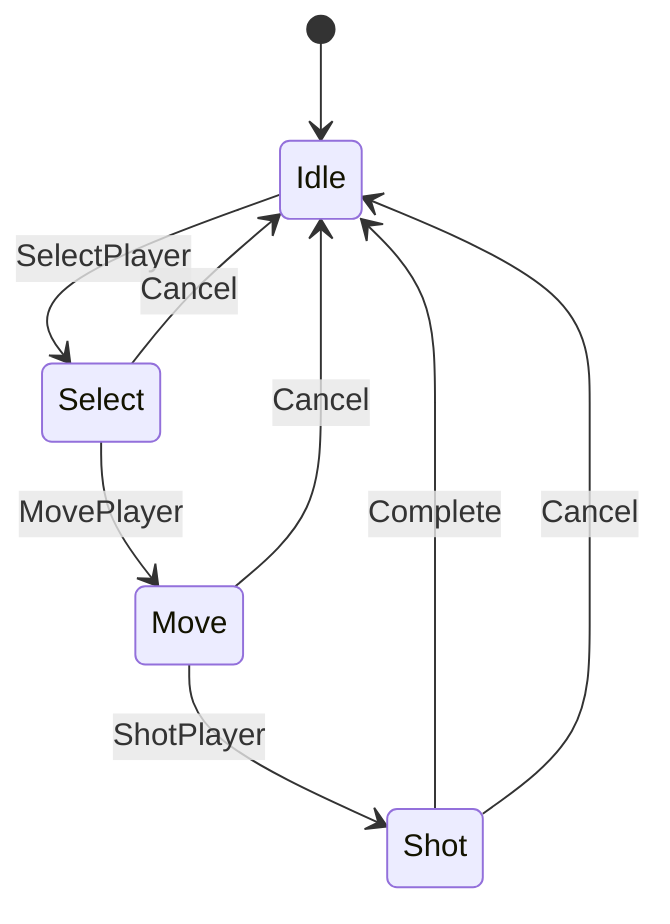

# ゲームロジック設計

## 目次

- [同時移動ラウンド制](#同時移動ラウンド制)
- [StateMachine による状態遷移](#statemachine-による状態遷移)
- [NPC AI](#npc-ai)
- [BFS 経路探索](#bfs-経路探索)
- [オフライン vs オンラインの挙動](#オフライン-vs-オンラインの挙動)

---

## 同時移動ラウンド制

人間プレイヤーが射撃対象を確定すると、全 NPC の行動をまとめて収集し、全プレイヤーの移動・射撃を**アトミックに**解決する。

### フロー

```
GameController.executeTurn()
  ├── 人間プレイヤーの TurnAction を作成
  │     { playerId, moveToNodeId, shotAtNodeId? }
  ├── networkAdapter.supportsNPC() が true なら
  │     TurnManager.collectNPCActions(model)
  │       ↓ 生存 NPC ごとに
  │     NPCBrain.decideTurn(model, npc) → TurnAction
  ├── networkAdapter.sendRoundActions(allActions)
  │     LocalAdapter:  全移動を Snapshot で確定 → 全射撃を順次解決
  │     ColyseusAdapter: 逐次 sendTurnAction() にフォールバック（未対応）
  └── VIS_UPDATE_VIEW を1回発火 → 全プレイヤーのアニメーションを同時再生
        RoundAnimationDelayMs 後に INPUT_LOCKED(false) で入力を再開
```

### LocalAdapter のアトミック解決

```
sendRoundActions(actions):
  1. Snapshot: 全プレイヤーの現在 nodeId を記録
  2. 全アクションの移動を適用（Snapshot 基準で衝突なし）
  3. 全アクションの射撃を解決（移動後の位置で判定）
  4. 各アクションごとに TurnResult を生成してコールバックへ
```

### INetworkAdapter インターフェース（抜粋）

```typescript
interface INetworkAdapter {
  sendTurnAction(action: TurnAction): void;
  sendRoundActions(actions: TurnAction[]): void; // 同時ラウンド用
  supportsNPC(): boolean;                        // オフライン時 true
}
```

### INPUT_LOCKED イベント

ラウンド処理中はユーザー入力をブロックする。

```
executeTurn() 開始
  → INPUT_LOCKED(true)  — InputHandler が NODE_CLICKED を無視
  → アニメーション再生（RoundAnimationDelayMs = 1500ms）
  → INPUT_LOCKED(false) — 入力再開
```

---

## StateMachine による状態遷移

各プレイヤーが独立した `StateMachine` インスタンスを持つ。

### 状態遷移図

```
Idle
  └─ [SelectPlayer] → Select
       └─ [MovePlayer] → Move
            └─ [ShotPlayer] → Shot
                 └─ [Complete] → Idle

どの状態からも [Cancel] → Idle へ戻る
```



### 各状態での NODE_CLICKED 処理

| 状態 | クリック内容 | 処理 |
|------|------------|------|
| Idle | 自プレイヤーのノード | SelectPlayer → Select に遷移 |
| Select | 到達可能ノード | MovePlayer → Move に遷移・移動先を記録 |
| Move | 視野内ノード | ShotPlayer → Shot に遷移・射撃先を記録 |
| Shot | 同じノード再クリック | Complete → executeTurn() → Idle |
| Shot | 別ノード | 射撃先を変更（状態は Shot のまま） |

---

## NPC AI

`src/logic/ai/` の3ファイルで構成。`NPCBrain` が Facade として機能する。

### 評価フロー

```
NPCBrain.decideTurn(model, npc)
  ├── getReachableNodes() で候補ノード列挙
  ├── NodeScorer.scoreNode() で各候補をスコアリング
  │     → 最高スコアノードを moveToNodeId に決定
  └── ShotSelector.selectShotTarget() で射撃対象を決定
        → shotAtNodeId（なければ undefined）
  → TurnAction を返す
```

### NodeScorer のスコア計算要素

| 定数 | 値 | 説明 |
|------|----|------|
| `CoverWeight` | 30 | 隣接エッジが少ない（壁に囲まれた）ノードへの加点 |
| `EnemyLOSPenalty` | -20 | 敵に視野内に入るノードへのペナルティ |
| `AmbushBonus` | 15 | NPC が敵を見えて敵から見えない場合のボーナス |
| `DistanceWeight` | -2 | 高HP時: 敵に近づく / 低HP時: 遠ざかる |
| `RetreatHPThreshold` | 40 | 撤退モードに切り替わる HP 閾値 |
| `RetreatCoverMultiplier` | 2 | 撤退モード時のカバーウェイト乗数 |
| `ShotLowHPPriority` | 10 | 低 HP 敵への射撃優先度ボーナス |

### ShotSelector の選択ロジック

1. 移動先ノードの向き角度を計算
2. `getVisibleNodesAtAngle()` で視野内ノードを取得
3. 視野内の生存敵を列挙
4. 各敵に対してスコア算出：`(100 - enemy.health) * ShotLowHPPriority + (1 / distance)`
5. 最高スコア敵のノードを返す

---

## BFS 経路探索

`src/model/model.ts` に実装。障害物で削除されたエッジを考慮した到達可能範囲計算。

```typescript
// 到達可能ノード一覧（BFS・最大 maxSteps ステップ）
getReachableNodes(fromNodeId: number, maxSteps: number): Set<number>

// 最短経路（BFS・最大 maxSteps ステップ以内なら経路を返す）
getPathToNode(fromNodeId: number, toNodeId: number, maxSteps: number): number[] | null
```

### BFS フロー

```
1. キューに開始ノードを積む（distance=0）
2. 隣接リストを参照して未訪問隣接ノードをキューに追加
3. distance が maxSteps を超えたらスキップ
4. 全到達可能ノードを Set<number> で返す
```

移動コスト（`PlayerConfig.MoveRange = 8`）内のノードのみが選択・表示される。

---

## オフライン vs オンラインの挙動

| 項目 | LocalAdapter（オフライン） | ColyseusAdapter（オンライン） |
|------|--------------------------|------------------------------|
| NPC | あり（`supportsNPC()=true`） | なし（`supportsNPC()=false`） |
| ラウンド処理 | `sendRoundActions()` でアトミック解決 | `sendTurnAction()` を逐次送信 |
| ターン結果 | プロセス内で即時計算 | サーバー権威（GameRoom → ServerGameLogic） |
| マップ生成 | クライアント側（Model） | サーバー側（`obstacles_ready` メッセージで配信） |
| 定数 | `src/config/GameConfig.ts` | `server_config` メッセージで上書き |

### ColyseusAdapter の注意点

- `game_started` はコールバック登録前に届く場合がある → `pendingGameStarted` でキャッシュして後で発火
- `onAdd` は `initializePlayers` の状態デルタより先に発火する場合がある → `Promise.resolve()` で1マイクロタスク遅延
- `MapSchema.forEach` の順序は保証されない → `playerOrder` 配列（挿入順）でターン管理
